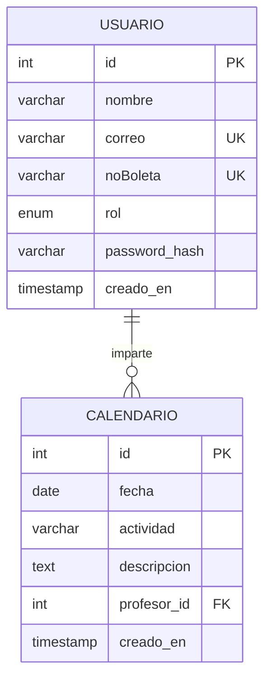

# Modelo entidad-relación

```mermaid
erDiagram
    USUARIO ||--o{ CALENDARIO : "imparte"
    USUARIO {
        int id PK
        varchar nombre
        varchar correo UK
        varchar noBoleta UK
        enum rol
        varchar password_hash
        timestamp creado_en
    }
    CALENDARIO {
        int id PK
        date fecha
        varchar actividad
        text descripcion
        int profesor_id FK
        timestamp creado_en
    }
```

La relación es de uno a muchos: un usuario con rol `profesor` puede impartir varias actividades, y cada actividad pertenece a un profesor.
